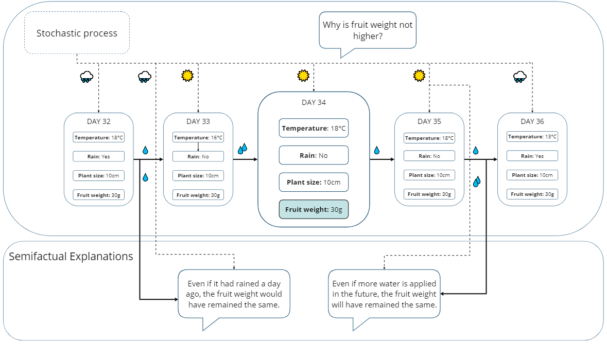

# Generating Semifactual Explantions for Reinforcement Learning


# SGRL-Advance and SGRL-Rewind


SGRL-Advance and SGRL-Rewind are two algorithms for generating semifactual explanations for reinforcement learning agents.



RACCER: Towards Reachable and Certain Counterfactual Explanations for Reinforcement Learning

### Requirements
```bash
python >= 3.8

```

### Installation
```bash 
git clone github.com/anonymous902109/SGRL
conda create -n sgrl python=3.8
conda activate sgrl
pip install -r requirements  

```

### Running Experiments


```python

python main.py

```
